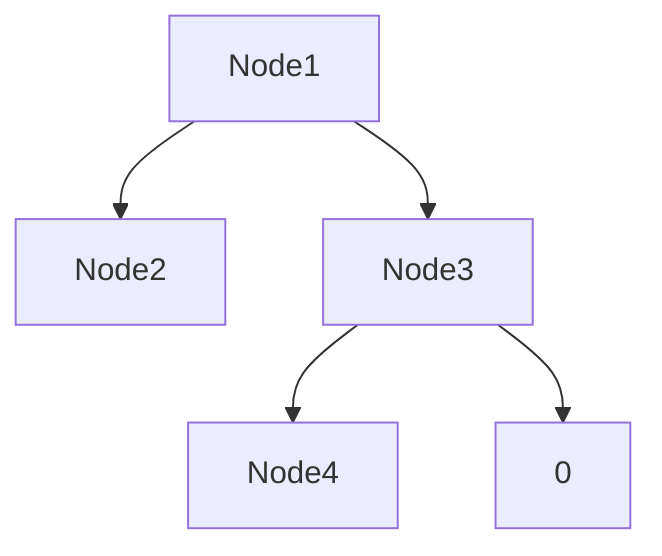

# Wizeline code challenge

## Week1

The solution is on the function **week1** in the **week1/solution.py** file.

Notes: The function expects the intervals input tuples to be `(minimum_value, maximum_value)`, so if the interval is set up as `(4, 3)` the solution will fail.

To run the tests execute from the project root directory:

```bash
python3 -m unittest tests/week1.py
```

## Week2

The solution is on the function **week2** in the **week2/solution.py** file.

Notes: I feel like I cheated, as I don't try to "interpret" the binary tree, and just try to use the representation format in my favor to quickly "guess" the maximum depth of the "real" structure. But it works, and is easy and fast, so is a win on my book.

### Example

Tree:



```text
Tree representation: ((00)((00)0))
Current Depth:       1222123332210
Max Depth:           1222223333333
```

To run the tests execute from the project root directory:

```bash
python3 -m unittest tests/week2.py
```

## Week5

The solution is on the function **week5** in the **week5/solution.py** file.

Notes: I cheated, if you sort the list, it is trivial to find the individual integer. And you don't need to use another data structure, just the original list.

To run the tests execute from the project root directory:

```bash
python3 -m unittest tests/week5.py
```
